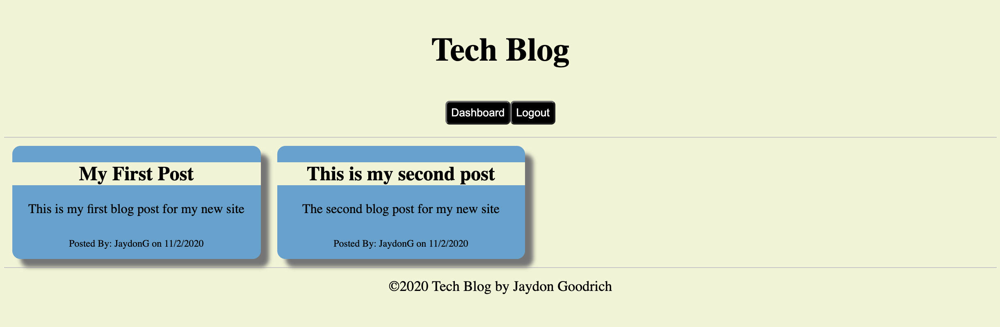
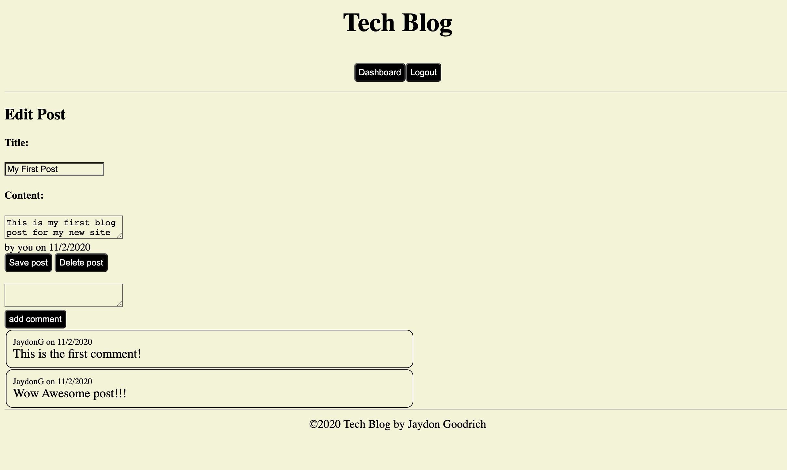

# tech-blog

## Description

A fullstack application that uses the MVC pattern. The views is produced by handlebars.js, with an express server and a JawsDB database deployed through Heroku. The point of this application is for users to create accounts and be able to create blog posts and comment on other peoples post.

## Table of Contents

* [Installation](#installation)
* [Usage](#usage)
* [Credits](#credits)
* [License](#license)

## Installation

* No installation is required

## Usage 

* Go to https://powerful-beyond-37749.herokuapp.com/
* Create an account by providing a username, email, and password
* Create posts and comment on other peoples post

## Contributing

All the code for this project was written by Jaydon Goodrich

## Tests

No tests are given for this app.

## License

Code released under the [Unlicense](http://unlicense.org/)

****

## Questions
For further questions I can be reached at:

GitHub: [Jaydon-Goodrich](https://github.com/Jaydon-Goodrich)

Email: JaydonGoodrich@gmail.com

Further Instructions: 

You can also reach out on the following social media platforms:

Instagram: Jaydon-Goodrich

Facebook: Jaydon-Goodrich

LinkedIn: Jaydon-Goodrich
    
## Reference

[Link to Deployed Site](https://powerful-beyond-37749.herokuapp.com/)

